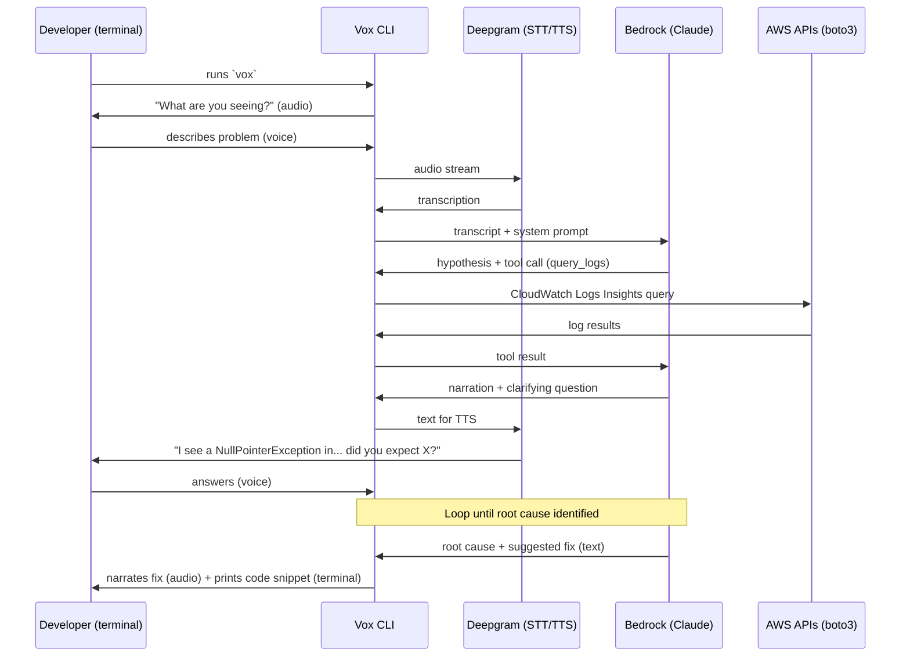
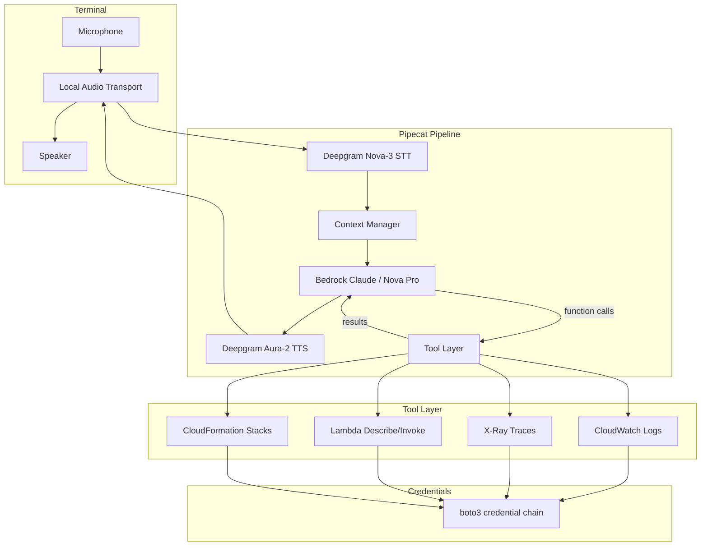
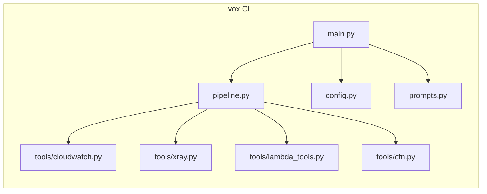
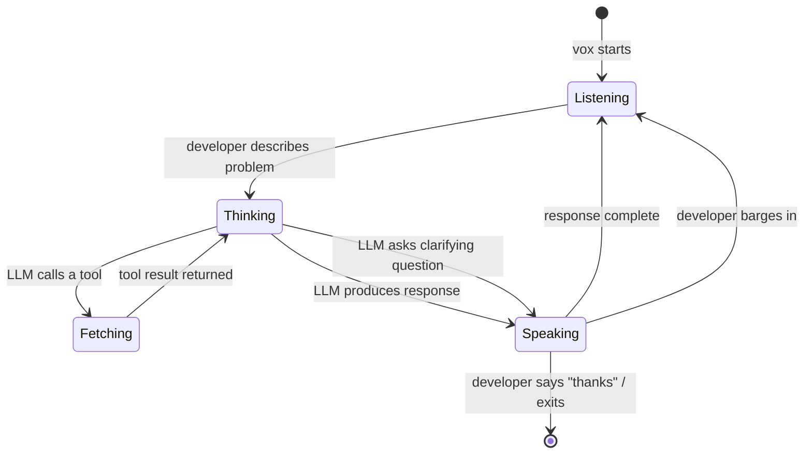

# Vox: voice pair debugger

A voice-driven AI agent that helps developers debug AWS applications through
Socratic conversation. Built with Pipecat, Deepgram, and Amazon Bedrock.

## Name candidates

| Name  | Rationale                                      |
|-------|------------------------------------------------|
| Vox   | Voice. Short CLI command. Memorable.           |
| Hunch | What a debugger forms. `hunch listen`.         |
| Rubi  | Rubber duck debugging, but alive.              |
| Pulse | Monitoring/diagnostics feel. `pulse`.          |

Working name: **Vox**.

## How it works



## Architecture



## Design decisions

### Audio access

Pipecat does not have a local audio transport that captures the microphone
directly. Instead, Pipecat's **development runner** serves a web UI at
`http://localhost:7860/client` that connects to the bot over WebRTC
(SmallWebRTC). The developer opens the browser tab, grants mic permission,
and speaks. Audio flows over a local WebRTC connection with sub-millisecond
network latency.

For the hackathon demo this is fine: open a browser tab and talk. The CLI
command `vox` starts the server and could auto-open the browser tab.

**Alternative for a CLI-native feel**: wrap the Pipecat dev runner in a
terminal command that also opens the browser. The developer still speaks into
the browser, but the terminal shows printed code snippets and log output.

### AWS credentials

Vox uses **boto3** directly. Credentials come from the standard chain:

1. Environment variables (`AWS_ACCESS_KEY_ID`, etc.)
2. `~/.aws/credentials` / `~/.aws/config` (profiles)
3. Instance profile / container credentials

No special setup. If the developer can run `aws sts get-caller-identity`, Vox
can access the same resources. The system prompt instructs the LLM to ask which
region/account to target if ambiguous.

### AWS access method

**boto3 inside Pipecat tools**, not shelling out to the AWS CLI.

Reasons:
- Structured responses (no output parsing)
- Faster (no subprocess overhead)
- Easier error handling
- Can stream results back to the LLM mid-conversation

### Does Vox write code?

**MVP (hackathon): no.** Vox narrates the root cause and suggests where/what to
change. It prints a code snippet to the terminal while speaking the explanation.

**Future:** could write a patch file, open a PR, or apply changes via an editor
integration. Out of scope for the hackathon.

### CLI interface

```
vox              # start server, open browser at localhost:7860/client
vox --region X   # override AWS region
vox --profile X  # override AWS profile
```

The developer runs `vox`, a browser tab opens for mic/speaker access via
WebRTC. The terminal stays active for printing code snippets and logs.

## Component breakdown



### Files

| File                   | Purpose                                          |
|------------------------|--------------------------------------------------|
| `main.py`             | CLI entry point, arg parsing, pipeline startup   |
| `pipeline.py`         | Pipecat pipeline assembly                        |
| `config.py`           | Settings (region, profile, model, voice)         |
| `prompts.py`          | System prompt for the debugging persona          |
| `tools/__init__.py`   | Tool registry                                    |
| `tools/cloudwatch.py` | query_logs, get_log_group, filter_log_events     |
| `tools/xray.py`       | get_trace_summaries, get_trace_by_id             |
| `tools/lambda_tools.py` | describe_function, get_recent_invocations      |
| `tools/cfn.py`        | describe_stack, get_stack_events                 |

## Interaction model



The developer can interrupt (barge-in) at any time. Pipecat + Deepgram handle
turn detection and barge-in natively.

## Tech stack

| Layer         | Technology                      | Notes                        |
|---------------|---------------------------------|------------------------------|
| Orchestration | Pipecat 1.x                     | Pipeline + function calling  |
| STT           | Deepgram Nova-3                 | Real-time streaming          |
| TTS           | Deepgram Aura-2                 | Low-latency synthesis        |
| LLM           | Amazon Bedrock (Claude Sonnet)  | Tool use, streaming          |
| AWS access    | boto3                           | Standard credential chain    |
| Audio         | SmallWebRTC (browser tab)       | localhost:7860/client        |
| Language      | Python 3.11+                    |                              |

## Hackathon demo script

1. Pre-plant a bug: Lambda function that reads from DynamoDB but uses wrong
   key attribute name. Returns 500 on the `/users` endpoint.
2. Developer runs `vox`.
3. Vox: "What are you seeing?"
4. Developer: "My /users API is returning 500 errors."
5. Vox fetches CloudWatch logs for the API Gateway + Lambda.
6. Vox: "I see a KeyError on 'userId' in the Lambda. The DynamoDB table uses
   'user_id' as the partition key. Did you recently rename that attribute?"
7. Developer: "Oh, I refactored the model yesterday."
8. Vox: "That's the issue. In `handler.py` line 23, change `item['userId']` to
   `item['user_id']`." (prints snippet to terminal)
9. Done in under 90 seconds. Fully voice-driven.
